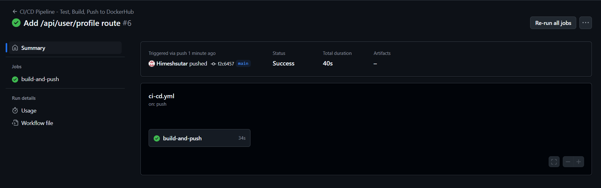
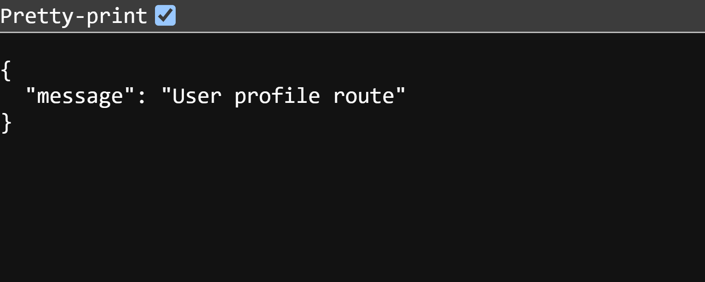

# CI-CD-Pipeline-Project-1

📘 Project Title:

CI/CD Pipeline with GitHub Actions & Docker (No Cloud Needed)

🎯 Objective:

To automate the process of building, testing, and deploying a Node.js application using GitHub Actions, Docker, and Minikube (local Kubernetes).

🛠 Tools Used:

GitHub Actions

Docker & Docker Hub

Minikube

Kubernetes

Node.js

✅ What’s Done:

Configured GitHub Actions to run tests, build the Docker image, and push it to Docker Hub automatically on every code push.

Dockerized the Node.js application.

Deployed the image locally on Minikube using Kubernetes.

Successfully accessed the app via NodePort using Minikube IP.

🧪 Result:

✅ 1. Set Up GitHub Actions Workflow

The GitHub Actions workflow automates the CI/CD pipeline. It runs tests, builds the Docker image, and pushes it to Docker Hub after every push to the repository.

🐳 2. Build & Push Docker Image

The Docker image is built and pushed to Docker Hub for easy deployment to the Kubernetes cluster.

⬇️ 3. Pull Docker Image Locally

The Docker image is pulled locally for testing before deployment.

🚀 4. Deploy App using Minikube

The application is deployed locally using Minikube and Kubernetes. The app is accessible through Minikube’s IP.

🆕 5. Add New Features to our App:

 CI/CD pipeline successfully ran when the /api/user/profile route was added and pushed.

This confirms that your new API route is running successfully on your local server.

🔧 Current Status:

✅ The CI/CD pipeline is fully functional — code changes trigger automated testing, Docker image builds, and deployment on a local Minikube cluster.

✅ The application is running smoothly via NodePort on Minikube.

✅ A new API endpoint/route has been successfully added and tested.

📦 All changes are containerized and version-controlled.
trigger
